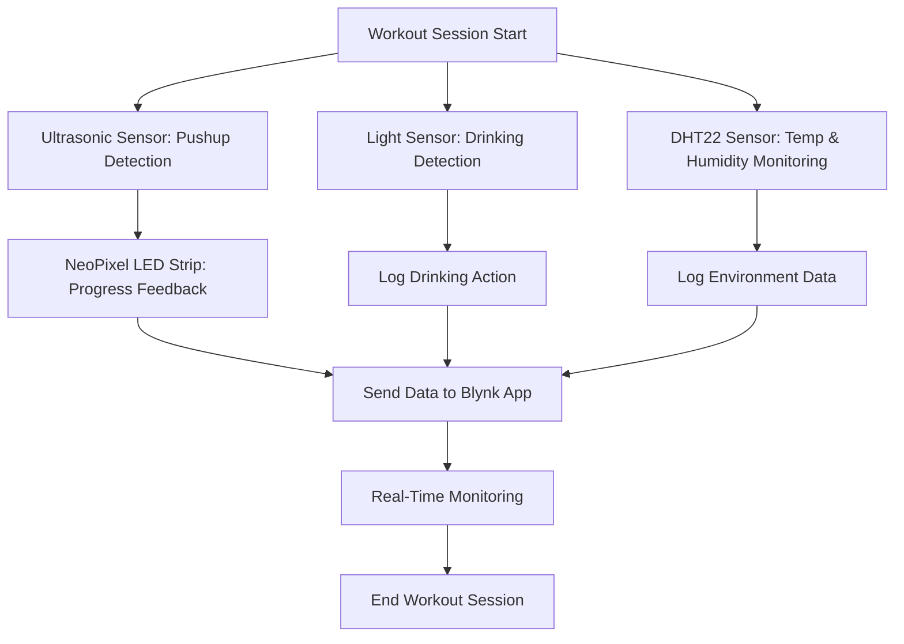

# IoT Ex5: Acquiring and Manifesting Sensoric Data - MyTrainingSet

## Description

This project aims to assist home trainers in creating an efficient and motivating training environment.

### Key Features:

- **Pushup Counting**: Tracks pushups in real time using an ultrasonic sensor.
- **Hydration Monitoring**: Detects instances of drinking water with a light sensor.
- **Environmental Monitoring**: Logs temperature and humidity levels using a DHT22 sensor.
- **Visual Feedback**: Displays workout progress through a NeoPixel LED strip.
- **Remote Monitoring**: Connects to the **Blynk app** for real-time monitoring and control.

The system is powered by an **ESP32 microcontroller**, providing seamless integration between sensors and remote devices.

---

## System Functionality

1. **Pushup Monitoring**:
   - An ultrasonic sensor measures the distance to detect pushup repetitions.
2. **Hydration Detection**:
   - A light sensor identifies when the user drinks water during the session.
3. **Environmental Feedback**:
   - The DHT22 sensor logs temperature and humidity in the training space.
4. **Visual Representation**:
   - A NeoPixel LED strip changes its pattern based on the number of pushups completed.
5. **Remote Control & Monitoring**:
   - The **Blynk app** allows users to monitor progress and control system settings remotely.

---

## Components Used

| Component                 | Description                                                                 |
| ------------------------- | --------------------------------------------------------------------------- |
| **ESP32 Microcontroller** | The main processing unit connecting all sensors and the Blynk app.          |
| **Ultrasonic Sensor**     | Measures distance to accurately count pushup repetitions.                   |
| **DHT22 Sensor**          | Logs the environmental temperature and humidity.                            |
| **Light Sensor**          | Detects when the user drinks water, ensuring hydration tracking.            |
| **NeoPixel LED Strip**    | Provides visual feedback, motivating the user by indicating progress.       |
| **Blynk App**             | Mobile app for remote monitoring, visualization, and control of the system. |

---

## Installation Instructions

1. **Hardware Setup**:
   - Connect the **ESP32 microcontroller** to the sensors and ensure proper connections.
   - Position the **ultrasonic sensor** near the ground to detect pushups effectively.
   - Place the **light sensor** near the water bottle or drinking area.
   - Mount the **NeoPixel LED strip** in a visible location for workout feedback.
2. **WiFi Connection**:
   - Connect the ESP32 to a stable WiFi network to enable communication with the **Blynk app**.
3. **Power Supply**:
   - Use a standalone power supply for uninterrupted operation during workouts.
4. **Blynk Configuration**:
   - Set up the Blynk app and link it to the ESP32 for real-time monitoring.

---

## Workflow Diagram



---

## Demo Video

Watch the system in action here:
[](https://youtu.be/13TGdVSu8Rk)

---

## Code Snippet

Here is an example of the ultrasonic sensor pushup counting logic:

```cpp
void loop()
{
  // Handle Blynk communication
  Blynk.run();
  // Check if training mode is on
  if(trainingOn == true){
    currMillisDrink = millis();
    int lightRate = analogRead(LIGHT_SENSOR_PIN);
    int cm = ultrasonic_measure(TRIGGER_PIN, ECHO_PIN, MAX_DISTANCE);
    // Check if the light sensor indicates drinking and enough time has passed
    if(lightRate < lightTrashold && isDrinking == false && currMillisDrink - prevMillisDrink >= 2000){
      isDrinking = true;
      drinkCounter++;
      prevMillisDrink = currMillisDrink;
    }
    ...
```

---

## Authors

- **Gal Trodel**
- **Guy Gal**

---

## Future Improvements

- Add a voice assistant to provide verbal workout updates.
- Incorporate heart rate monitoring using additional sensors.
- Develop data analytics for performance tracking over time.

---

## Contact

For further questions or suggestions, reach out to:

- **Gal Trodel**: galtrudel@gmail.com
