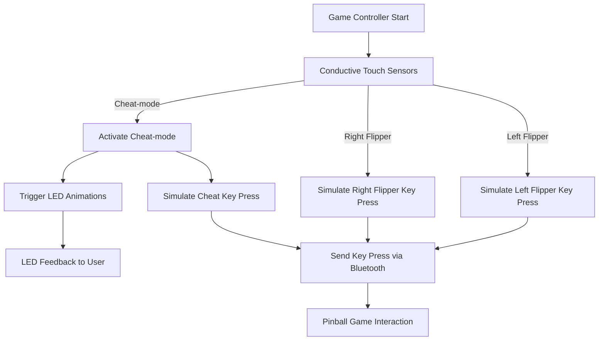

# Computer Game - Pinball

## Description

This project transforms an **ESP32 microcontroller** into a pinball game controller that combines touch sensors, a **NeoPixel LED strip**, and Bluetooth keyboard functionality for a seamless gaming experience.

The system:

- Detects user interactions via **conductive touch sensors** to control the **Left Flipper**, **Right Flipper**, and **Cheat-mode**.
- Uses **Bluetooth** to simulate key presses, enabling interaction with a pinball game on a computer.
- Provides colorful LED animations for interactive feedback during **Cheat-mode** using a custom **Led_Party** library.

---

## Key Features

1. **Multi-Touch Support**:
   - Allows simultaneous use of the left and right flipper sensors through a custom **Button** class.
2. **Cheat-Mode Activation**:
   - Touching the **Cheat-mode** sensor triggers:
     - **NeoPixel LED effects** for visual feedback.
     - Key presses to activate cheat functionalities in the game.
3. **Bluetooth Connectivity**:
   - The system uses the **BleKeyboard** library to simulate key presses for flipper control and cheat interactions.
4. **Interactive Feedback**:
   - A **NeoPixel LED strip** enhances user experience by providing real-time visual effects.

---

## Components Used

| Component                    | Description                                                                 |
| ---------------------------- | --------------------------------------------------------------------------- |
| **ESP32 Microcontroller**    | The main processing unit that interfaces with sensors, LEDs, and Bluetooth. |
| **Conductive Touch Sensors** | Detect touch input to control flippers and trigger cheat mode.              |
| **NeoPixel LED Strip**       | Provides colorful LED feedback and animations during cheat mode.            |
| **Custom Button Library**    | Manages touch input and enables simultaneous multi-touch functionality.     |
| **Custom Led_Party Library** | Controls LED animations and effects for enhanced interaction.               |
| **BleKeyboard Library**      | Enables Bluetooth keyboard functionality to simulate key presses.           |

---

## System Workflow



---

## Installation Instructions

1. **Hardware Setup**:
   - Connect the **conductive touch sensors** to the ESP32 GPIO pins.
   - Connect the **NeoPixel LED strip** to a PWM-capable pin.
2. **Bluetooth Setup**:
   - Use the **BleKeyboard** library to simulate key presses.
   - Pair the ESP32 with your computer for Bluetooth communication.
3. **Custom Libraries**:
   - Install and include the **Button** and **Led_Party** libraries.
4. **Testing**:
   - Test each sensor for its respective action:
     - Left sensor → Left flipper key press.
     - Right sensor → Right flipper key press.
     - Cheat-mode sensor → LED animations + cheat key press.

---

## Code Snippet

Here is an example of how touch input is managed for the flippers and cheat mode:

```cpp
void loop() {
  touch = touchRead(CONDUCTIVE_SENSOR_PIN_1);
  while (touch < COND_THR){           // If the cheat touch sensor is pressed
    Keyboard.press(KEY_LEFT_ARROW);   // Simulate pressing the left arrow key
    Keyboard.press(KEY_RIGHT_ARROW);  // Simulate pressing the right arrow key
    // Update LED effects
    led1.Update();
    led2.Update();
    led3.Update();
    led4.Update();
    led5.Update();
    delay(10);
    Keyboard.releaseAll();
    touch = touchRead(CONDUCTIVE_SENSOR_PIN_1);
  }
```

---

## Demo Video

Watch the **Pinball Game Controller** in action here:
[](https://youtu.be/5w6sN5l7Z9A?si=BSW6h_DcUuLmCS0T)

---

## Authors

- **Gal Trodel**
- **Guy Gal**

---

## Future Improvements

- Add accelerometer support for tilt detection in the game.
- Introduce sound effects for tactile feedback.
- Implement a web interface to configure key mappings and LED behaviors.

---

## Contact

For inquiries or suggestions, reach out to:

- **Gal Trodel**: galtrudel@gmail.com
