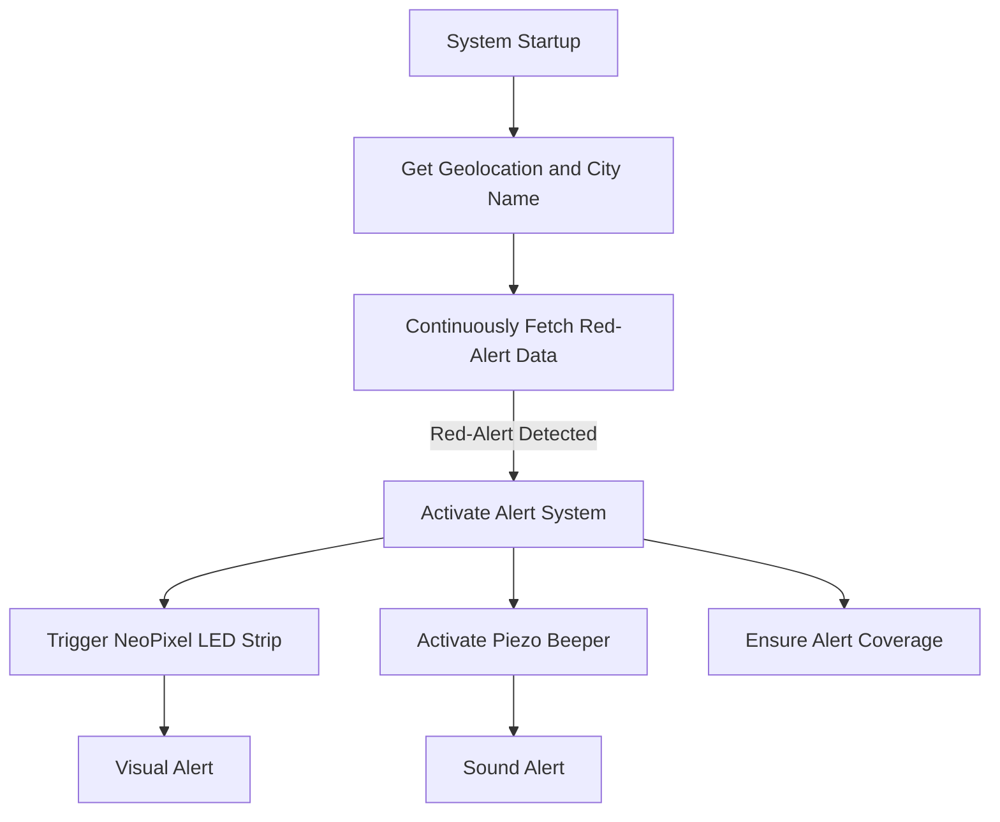

# Red Alert

## Description

This project addresses a critical safety issue experienced. While attending a class, a **Red-Alert siren** sounded in the area but was inaudible inside the enclosed classroom. This dangerous situation inspired us to create a system that:

- **Monitors Red-Alerts** from the internet.
- **Enhances safety** by providing visual and auditory alerts in enclosed spaces.

The system uses an **ESP32 microcontroller** to fetch and manifest real-time **Red-Alert notifications**. This inexpensive and scalable solution can be installed in classrooms, ensuring timely alerts for students and staff.

---

## System Functionality

1. **Geolocation Setup**:
   - The ESP32 makes HTTP requests during initialization to determine:
     - **Current geolocation** (latitude and longitude).
     - **City name** using Google services.
2. **Continuous Monitoring**:
   - The ESP32 continuously checks the **Pikud HaOref** servers every second for updated Red-Alerts.
3. **Alert Activation**:
   - When a **Red-Alert** is detected:
     - A **NeoPixel LED strip** provides a **visual alert**.
     - A **piezo beeper** emits a **sound alert** to ensure everyone can hear the warning.
4. **Deployment**:
   - The system is designed to be installed in classrooms or similar enclosed spaces, where external sirens may not be audible.

---

## Components Used

| Component                 | Description                                                      |
| ------------------------- | ---------------------------------------------------------------- |
| **ESP32 Microcontroller** | Handles data fetching, processing, and control of alert outputs. |
| **Built-in WiFi Module**  | Connects to the internet to fetch Red-Alert data in real-time.   |
| **NeoPixel LED Strip**    | Provides a bright visual alert when a Red-Alert is detected.     |
| **Piezo Beeper**          | Emits a loud sound alert for auditory notification.              |

---

## Installation Instructions

1. **Setup Hardware**:
   - Connect the **NeoPixel LED strip** to a GPIO pin of the ESP32.
   - Attach the **piezo beeper** to another GPIO pin for sound output.
2. **WiFi Configuration**:
   - Ensure the ESP32 connects to a **stable WiFi network** for internet access.
3. **Deployment**:
   - Mount the NeoPixel LED strip in a **visible location** within the classroom.
   - Position the piezo beeper to ensure the alert sound reaches all areas of the room.

---

## System Workflow



---

## Demo Video

Watch the **Red-Alert Notification System** in action here:
[](https://youtu.be/FwuBgovJwmo)

---

## Code Snippet

Below is an example of fetching Red-Alert data and activating the alert system:

```cpp
void loop() {
  bool alert = getRedAlerts(city);

  if (alert){
    unsigned long startMillis = millis();
    unsigned long currentMillis = millis();
    while ((currentMillis - startMillis < ALERET_LENGTH_IN_MILIS)){
      leds.Update();
      beeper1.Update();
      currentMillis = millis();
    }
    leds.Turn_Off();
    beeper1.Turn_off();
  }
  delay(1000); // Check every second
}
```

---

## Authors

- **Gal Trodel**
- **Guy Gal**

---

## Future Improvements

- Add a small screen to display live Red-Alert updates and city name.
- Integrate SMS or email notifications for redundancy.
- Optimize power consumption for battery-operated deployment.

---

## Contact

For inquiries or suggestions, reach out to:

- **Gal Trodel**: galtrudel@gmail.com

---
