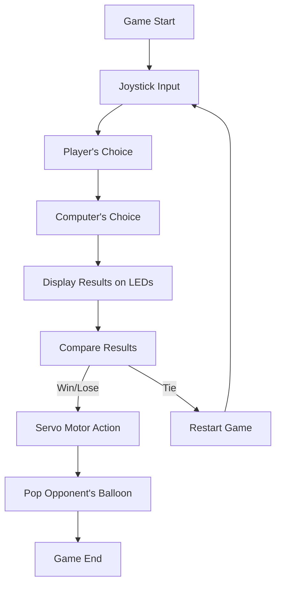

# Rock-Paper-Scissors IoT Game

## Description

Experience an engaging and interactive **Rock-Paper-Scissors** game powered by the ESP32 microcontroller! This project combines physical feedback with intuitive user controls to bring the classic game to life.

### Key Features:

- **Joystick-Controlled Input**: Seamless user control via an analog joystick.
- **Visual Feedback with LEDs**: Multi-colored LEDs represent both player and computer choices.
- **Physical Interaction**: A servo motor pops balloons to symbolize game victories.
- **ESP32 Integration**: Handles all processing and peripheral controls in real-time.

The result? A surprising and immersive game where you can challenge the computer and enjoy a physical representation of the gameplay.

---

## How It Works

1. **Player Input**: Use the joystick to select your move (rock, paper, or scissors).
2. **Computer's Move**: The computer randomly generates its choice.
3. **Visual Representation**: Six LEDs display the moves made by both the player and computer.
4. **Game Outcome**:
   - The servo motor rotates based on the result (win/lose/tie).
   - If a player wins, the servo motor pops the opponent's balloon, offering physical and visual feedback.

---

## Components Used

| Component                 | Description                                                              |
| ------------------------- | ------------------------------------------------------------------------ |
| **ESP32 Microcontroller** | Handles the game logic and controls all peripherals.                     |
| **Servo Motor**           | Rotates based on the game outcome to provide physical feedback.          |
| **Joystick Module**       | Provides analog input along the X and Y axes for intuitive user control. |
| **Multi-Colored LEDs**    | Six LEDs display the choices made by the player and computer.            |
| **Balloons**              | Represent player and computer lives, popped by the servo upon a victory. |

---

## System Workflow



---

## Demo Video

Watch the full demo of our **Rock-Paper-Scissors IoT Game** here:
[](https://www.youtube.com/watch?v=5xcxNEWnAhY)

---

## Setup Instructions

Follow these steps to recreate the project:

1. **Gather the Components**:

   - ESP32 microcontroller
   - Servo motor
   - Joystick module
   - Multi-colored LEDs
   - Balloons
   - Jumper wires and breadboard

2. **Connections**:

   - Connect the joystick module to the ESP32 analog pins.
   - Connect the servo motor signal wire to a PWM-capable pin on the ESP32.
   - Connect the LEDs to GPIO pins on the ESP32.

3. **Code Deployment**:

   - Upload the provided Arduino sketch to the ESP32.

4. **Testing**:
   - Power up the circuit and use the joystick to play the game.

---

## Code Snippet

Here's a small snippet of the core logic:

```cpp
void loop() {
  // Generate a random number between 0 and 2
  int randomNumber = random(3);

  // Read analog input from joystick
  int x = analogRead(JOYSTICK_X_PIN);
  int y = analogRead(JOYSTICK_Y_PIN);

  // Check joystick input for each direction
  if(y < left_threshold){
    // Left direction
    turnOnLights(randomNumber, 0);
  }
  if(y > right_threshold){
    // Right direction
    turnOnLights(randomNumber, 1);
  }
  if(x > up_threshold){
    // Up direction
    turnOnLights(randomNumber ,2);
  }

  // Check if current position is at extreme ends - games ended
  if(currentPos == 0 ||currentPos == 4){
    // Move servo to center position after delay
    currentPos = 2;
    delay(3000);
    myservo.write(pos[currentPos]);
  }

  // Add delay to avoid rapid readings
  delay(300);
}
```

---

## Authors

- **Gal Trodel**
- **Guy Gal**

---

## Future Enhancements

- Add a display screen to show scores and moves.
- Implement sound effects for a richer gaming experience.
- Enable multiplayer functionality via Bluetooth.

---

## License

This project is released under the MIT License. Feel free to use, modify, and share!

---

## Contact

For questions or suggestions, reach out at:

- **Gal Trodel**: galtrudel@gmail.com

---
