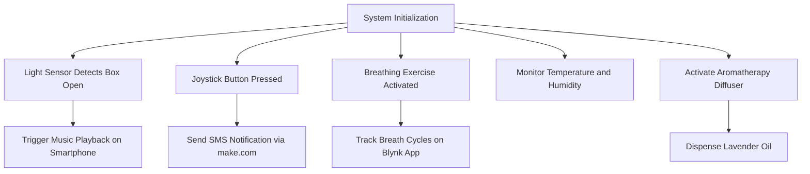

# Self Stress Reduction IoT Kit

## Description

The **Self Stress Reduction IoT Kit** is a portable and comprehensive system designed to help users manage stress and promote relaxation through a combination of physical sensors, web services, and smartphone interactions. Using technologies such as **Blynk** and **make.com**, the kit integrates guided breathing exercises, emergency alerts, aromatherapy, and relaxing music to enhance well-being.

This project highlights how IoT can transform everyday environments into calm, stress-free spaces with practical tools and seamless automation.

---

## System Functionality

1. **Automatic Relaxing Music Playback**:

   - A **light sensor** detects when the kit box is opened.
   - The system triggers relaxing music to play on the user’s smartphone for an immersive calming experience.

2. **Emergency Alert System**:

   - A **joystick button** serves as an emergency button.
   - When pressed, it sends an **SMS notification** to a designated contact via **make.com** for immediate assistance.

3. **Guided Breathing Training**:

   - An **Adafruit NeoPixel LED strip** visually guides users through timed breathing exercises (inhalation and exhalation).
   - The **Blynk app** tracks the number of completed breath cycles.

4. **Aromatherapy with Essential Oil Diffuser**:

   - A **servo motor** operates an essential oil diffuser to dispense drops of lavender oil for relaxation.
   - Activation is controlled via the **Blynk app**.

5. **Monitoring Environmental Conditions**:
   - A **DHT22 sensor** measures **temperature and humidity**, ensuring a comfortable environment.

---

## Components Used

| Component                       | Description                                                                |
| ------------------------------- | -------------------------------------------------------------------------- |
| **ESP32 Microcontroller**       | Main processing unit that interfaces with sensors and controls the system. |
| **Adafruit NeoPixel LED Strip** | Provides visual feedback for guided breathing exercises.                   |
| **DHT22 Sensor**                | Monitors temperature and humidity levels in the environment.               |
| **Servo Motor**                 | Dispenses lavender oil for aromatherapy.                                   |
| **Joystick Button**             | Emergency button to trigger SMS alerts.                                    |
| **Light Sensor**                | Detects the opening of the kit box to trigger music playback.              |
| **Battery Pack**                | Powers the entire kit for portability.                                     |
| **Blynk App**                   | Mobile app for monitoring and controlling all system functionalities.      |
| **make.com**                    | Web service platform for SMS notification integration.                     |

---

## Installation Instructions

1. **Hardware Setup**:
   - Connect the **DHT22 sensor**, **servo motor**, and **NeoPixel LED strip** to the ESP32 microcontroller.
   - Attach the **light sensor** to detect box opening.
   - Wire the **joystick button** as an emergency trigger.
2. **WiFi Configuration**:
   - Ensure the ESP32 connects to a **stable WiFi network** for Blynk and make.com communication.
3. **Blynk App Setup**:
   - Use the Blynk app to monitor environmental data and control the essential oil diffuser.
4. **SMS Integration**:
   - Configure the **make.com** platform to send emergency SMS notifications when triggered.
5. **Power Supply**:
   - Use a **battery pack** to ensure the kit is portable and easy to use anywhere.

---

## System Workflow



---

## Demo Videos

- **Short Demo**: [](https://www.youtube.com/watch?v=Ey7w1-B9fYU)
- **Full Tutorial**: [](https://www.youtube.com/watch?v=4iIKyHKX2Ko)

---

## Instructable Link

For a full step-by-step guide, visit our Instructable:
[**Self Stress Reduction IoT Kit**](https://www.instructables.com/IoT-Kit-Self-Stress-Reduction/)

---

## Code Snippet

Here is an example of activating the aromatherapy diffuser using a servo motor:

```cpp
void loop() {
  unsigned long currentMillis = millis();

  // Update strip for breath train
  if (breath_train == 1) {
    led_strip_update();
  }

  // Servo up
  if (diffude == 1 && pos < 90) {
    pos += 2;
    myservo.write(pos);
  }

  // End of defuse
  if (diffude == 1 && currentMillis - last_defuse > defuseDuration) {
    diffude = 0;
  }

  // Servo down
  if (diffude == 0 && pos > 0) {
    pos -= 2;
    myservo.write(pos);
  }

  Blynk.run();
  timer.run();

  // Light sensor reader for box open or close
  int sensorValue = analogRead(LIGHT_SENSOR_PIN);
  if (sensorValue < lightSensorThreshold && !box_is_open && currentMillis - last_music_switch > musicSwitchDelay) {
    last_music_switch = currentMillis;
    box_is_open = true;
    Serial.println("Play music");
    Serial.print("light: ");
    Serial.println(sensorValue);
    play_music();
  }
  if (sensorValue > lightSensorThreshold && box_is_open && currentMillis - last_music_switch > musicSwitchDelay) {
    last_music_switch = currentMillis;
    box_is_open = false;
    Serial.println("Stop music");
    Serial.print("light: ");
    Serial.println(sensorValue);
    stop_music();
  }

  // Handle a click on emergency button
  int emergency_button = digitalRead(JOYSTICK_SW_PIN);
  if (emergency_button == 0 && currentMillis - last_sms > smsCooldown) {
    last_sms = currentMillis;
    Serial.println("emergency clicked");
    send_sms();
  }
}
```

---

## Authors

- **Gal Trodel**
- **Guy Gal**

---

## Future Improvements

- Integrate a **heart rate sensor** for stress-level monitoring.
- Add a **speaker** to play relaxing music directly from the kit.
- Implement **data analytics** in the Blynk app to track stress reduction progress.

---

## Contact

For questions or suggestions, reach out to:

- **Gal Trodel**: galtrudel@gmail.com

---
